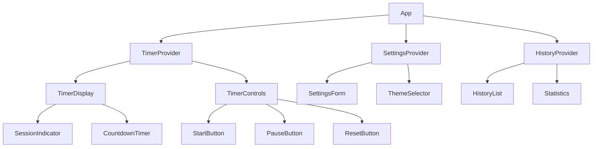

# Pomodorro Timer Application Architecture

## 1. System Overview
A single-page application implementing the Pomodoro Technique with focus on performance, accessibility, and user experience.

## 2. Technology Stack

### Frontend
- **Framework**: React 18+ with TypeScript
- **Styling**: Tailwind CSS with CSS custom properties
- **State Management**: React Context API + useReducer hook
- **Build Tool**: Vite 4+ for fast development and optimized builds
- **Routing**: React Router for potential future multi-page features
- **Testing**: Jest + React Testing Library for unit tests, Cypress for E2E

### Storage & Data
- **Local Storage**: Browser localStorage for settings and session history
- **IndexedDB**: For larger datasets and offline capabilities
- **Data Format**: JSON with schema validation

### Development Tools
- **Linting**: ESLint with TypeScript rules
- **Formatting**: Prettier with consistent code style
- **Type Checking**: Strict TypeScript configuration
- **Git Hooks**: Husky for pre-commit validation

## 3. Architecture Patterns

### Component Architecture


### State Management
- **Context Hierarchy**: Timer → Settings → History
- **Immutable State**: All state updates create new objects
- **Derived State**: Computed values from base state
- **Event-Driven**: Actions trigger state updates

## 4. Data Models

### Timer State
```typescript
interface TimerState {
  currentSession: SessionType;
  timeRemaining: number; // in seconds
  isRunning: boolean;
  isPaused: boolean;
  startTime: number | null;
  endTime: number | null;
}

type SessionType = 'work' | 'short-break' | 'long-break';
```

### Settings
```typescript
interface Settings {
  workDuration: number; // minutes
  shortBreakDuration: number; // minutes
  longBreakDuration: number; // minutes
  autoStart: boolean;
  notificationSound: string;
  theme: 'light' | 'dark' | 'auto';
  volume: number; // 0-100
}
```

### Session History
```typescript
interface Session {
  id: string;
  type: SessionType;
  duration: number; // seconds
  completedAt: Date;
  wasCompleted: boolean;
}
```

## 5. Component Structure

### Core Components
1. **TimerDisplay**: Shows current session and countdown
2. **TimerControls**: Start, pause, reset, skip controls
3. **SessionIndicator**: Visual indicator of current session type
4. **SettingsForm**: Configuration interface
5. **HistoryList**: Session history display
6. **Statistics**: Productivity metrics

### Custom Hooks
- **useTimer**: Timer logic and state management
- **useSettings**: Settings persistence and validation
- **useHistory**: Session history management
- **useNotifications**: Audio/visual notifications
- **useLocalStorage**: Generic localStorage wrapper

## 6. Testing Strategy

### Unit Tests
- **Timer Logic**: Timer state transitions, duration calculations
- **Settings Validation**: Input validation, persistence
- **Component Rendering**: Component output with different props
- **Custom Hooks**: Hook behavior and state management

### Integration Tests
- **User Workflows**: Complete Pomodoro cycles
- **Settings Persistence**: Settings save/load functionality
- **History Tracking**: Session recording and display
- **Notification System**: Audio/visual alerts

### E2E Tests
- **Complete User Journey**: From setup to session completion
- **Cross-browser Compatibility**: Chrome, Firefox, Safari, Edge
- **Mobile Responsiveness**: Touch interactions and layout
- **Offline Functionality**: Basic features without internet

## 7. Performance Considerations

### Optimization Strategies
- **Debounced Updates**: Timer updates at 1-second intervals
- **Virtual Scrolling**: For large history lists
- **Lazy Loading**: Code splitting for non-critical features
- **Memoization**: React.memo for expensive components
- **Efficient Rendering**: Minimal re-renders with proper dependencies

### Bundle Optimization
- **Tree Shaking**: Remove unused code
- **Code Splitting**: Separate vendor and application code
- **Asset Optimization**: Compressed images and optimized fonts
- **Service Worker**: Cache static assets for offline use

## 8. Accessibility Implementation

### WCAG 2.1 AA Compliance
- **Keyboard Navigation**: Full functionality without mouse
- **Screen Reader Support**: ARIA labels and semantic HTML
- **Color Contrast**: Minimum 4.5:1 for normal text
- **Focus Management**: Visible focus indicators
- **Motion Preferences**: Respect prefers-reduced-motion

### Testing Tools
- **axe-core**: Automated accessibility testing
- **Lighthouse**: Performance and accessibility audits
- **NVDA/JAWS**: Screen reader testing
- **Keyboard-only Testing**: Manual keyboard navigation testing

## 9. Security Considerations

### Data Protection
- **Local Storage Encryption**: Sensitive data encryption
- **Input Validation**: Sanitize all user inputs
- **XSS Prevention**: Content Security Policy headers
- **Secure Defaults**: Safe configuration options

### Privacy
- **No External Tracking**: No analytics or tracking scripts
- **Data Ownership**: User data stays on device
- **Clear Data**: Easy data deletion options
- **Transparency**: Clear privacy policy

## 10. Deployment Strategy

### Build Process
```bash
npm run build
# Output: dist/ folder with optimized assets
```

### Hosting Options
- **Vercel**: Automatic deployments, CDN distribution
- **Netlify**: Git-based deployments, form handling
- **GitHub Pages**: Simple static hosting
- **Cloudflare Pages**: Edge deployment and optimization

### CI/CD Pipeline
- **Automated Testing**: Run tests on every push
- **Build Validation**: Ensure production builds succeed
- **Security Scanning**: Dependency vulnerability checks
- **Performance Budgets**: Maintain performance standards

## 11. Monitoring and Analytics

### Error Tracking
- **Sentry**: Error monitoring and reporting
- **Custom Error Boundaries**: Graceful error handling
- **User Feedback**: Error reporting mechanism

### Performance Metrics
- **Core Web Vitals**: LCP, FID, CLS monitoring
- **Bundle Size**: Track asset sizes over time
- **Load Times**: Page load performance
- **User Interactions**: Response time tracking

## 12. Future Enhancements

### Phase 1 (Core Features)
- Complete Pomodoro functionality
- Basic settings and history
- Responsive design

### Phase 2 (Advanced Features)
- Statistics and analytics
- Export functionality
- Advanced customization

### Phase 3 (Platform Expansion)
- Desktop application (Electron)
- Mobile app (React Native)
- Team collaboration features
- Third-party integrations

## 13. Success Metrics

### Technical Metrics
- **Load Time**: < 2 seconds
- **Bundle Size**: < 500KB gzipped
- **Accessibility Score**: 100/100 on Lighthouse
- **Performance Score**: 90+ on Lighthouse

### User Metrics
- **Session Completion Rate**: > 80%
- **Daily Active Users**: Steady growth
- **User Retention**: > 50% after first week
- **Feature Adoption**: > 70% for core features

## 14. Risk Mitigation

### Technical Risks
- **Browser Compatibility**: Progressive enhancement approach
- **Performance Issues**: Performance budgets and monitoring
- **Data Loss**: Regular localStorage backups
- **Security Vulnerabilities**: Regular dependency updates

### Project Risks
- **Scope Creep**: Strict feature prioritization
- **Timeline Delays**: Agile development with sprints
- **Resource Constraints**: Efficient development practices
- **Quality Issues**: Comprehensive testing strategy