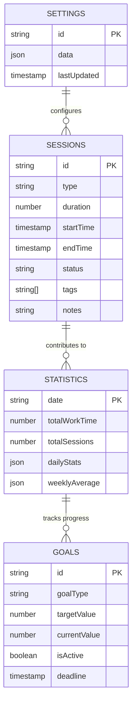

# Pomodorro Timer Data Persistence Architecture

## 1. Storage Overview

### 1.1 Storage Technologies
- **Primary Storage**: Browser localStorage (for settings and recent history)
- **Secondary Storage**: IndexedDB (for large history datasets and offline capabilities)
- **Session Storage**: In-memory state during application runtime
- **Backup Storage**: Export/Import functionality for data portability

### 1.2 Storage Capacity Considerations
```javascript
// Browser storage limits
const STORAGE_LIMITS = {
  localStorage: '5-10MB per domain',
  sessionStorage: '5-10MB per domain',
  indexedDB: '50% of disk space (browser dependent)',
  cookies: '4KB per cookie'
};
```

## 2. Data Models

### 2.1 Core Data Structures

#### Timer State (In-memory)
```typescript
interface TimerState {
  // Current session state
  currentSession: SessionType;
  timeRemaining: number; // seconds
  isRunning: boolean;
  isPaused: boolean;
  
  // Session tracking
  startTime: number | null; // timestamp
  endTime: number | null; // timestamp
  elapsedTime: number; // seconds
  
  // Cycle management
  completedWorkSessions: number; // 0-3
  currentCycle: number; // current cycle number
  
  // UI state
  lastNotificationTime: number | null;
  notificationQueue: Notification[];
}

type SessionType = 'work' | 'short-break' | 'long-break';
```

#### Application Settings (Persistent)
```typescript
interface AppSettings {
  // Timer durations (in minutes)
  workDuration: number;        // 1-60, default: 25
  shortBreakDuration: number;  // 1-30, default: 5
  longBreakDuration: number;   // 5-60, default: 15
  
  // Behavior settings
  autoStartBreaks: boolean;    // default: false
  autoStartWork: boolean;      // default: false
  longBreakInterval: number;   // 2-10, default: 4
  
  // Notification settings
  notificationSound: string;   // sound file name
  notificationVolume: number;  // 0-100, default: 80
  enableDesktopNotifications: boolean; // default: true
  enableSound: boolean;        // default: true
  enableVibration: boolean;    // default: true (mobile)
  
  // UI settings
  theme: 'light' | 'dark' | 'auto'; // default: 'auto'
  fontSize: 'small' | 'medium' | 'large'; // default: 'medium'
  reduceMotion: boolean;       // default: false
  
  // Data settings
  historyRetentionDays: number; // 0=forever, 7-365, default: 30
  maxHistoryEntries: number;    // 100-10000, default: 1000
  autoExportEnabled: boolean;   // default: false
  autoExportInterval: 'daily' | 'weekly' | 'monthly'; // default: 'weekly'
  
  // Privacy settings
  analyticsEnabled: boolean;    // default: false
  crashReportingEnabled: boolean; // default: false
}
```

#### Session History (Persistent)
```typescript
interface SessionRecord {
  // Unique identifier
  id: string; // UUID v4
  
  // Session details
  type: SessionType;
  duration: number; // planned duration in seconds
  actualDuration: number; // actual duration in seconds
  startTime: Date;
  endTime: Date;
  
  // Completion status
  status: 'completed' | 'skipped' | 'interrupted' | 'abandoned';
  completionPercentage: number; // 0-100
  
  // Metadata
  tags: string[]; // user-defined tags
  notes: string; // user notes
  productivityScore: number; // 1-5, user rating
  
  // Technical metadata
  appVersion: string;
  deviceInfo: DeviceInfo;
  syncStatus: 'local' | 'synced' | 'pending';
}

interface DeviceInfo {
  platform: string;
  browser: string;
  screenResolution: string;
  timezone: string;
}
```

#### Statistics (Derived/Calculated)
```typescript
interface Statistics {
  // Time-based statistics
  totalWorkTime: number; // seconds
  totalBreakTime: number; // seconds
  totalSessions: number;
  
  // Daily statistics
  dailyStats: {
    date: string; // YYYY-MM-DD
    workSessions: number;
    workTime: number;
    breaks: number;
    breakTime: number;
    productivityScore: number;
  }[];
  
  // Weekly/Monthly aggregates
  weeklyAverage: {
    workSessions: number;
    workTime: number;
    averageSessionLength: number;
  };
  
  // Trends
  trends: {
    workTimeTrend: 'increasing' | 'decreasing' | 'stable';
    productivityTrend: 'improving' | 'declining' | 'stable';
    consistencyScore: number; // 0-100
  };
  
  // Goals progress
  goals: {
    dailyGoal: number; // target work sessions
    weeklyGoal: number; // target work hours
    currentProgress: number; // percentage
    streakDays: number; // consecutive days with sessions
  };
}
```

## 3. Storage Schema Design

### 3.1 localStorage Structure
```javascript
// localStorage keys and structure
const LOCAL_STORAGE_KEYS = {
  SETTINGS: 'pomodorro_settings_v1',
  RECENT_HISTORY: 'pomodorro_recent_history_v1',
  STATISTICS: 'pomodorro_statistics_v1',
  APP_STATE: 'pomodorro_app_state_v1',
  MIGRATION_VERSION: 'pomodorro_migration_version'
};

// Example localStorage data structure
const localStorageData = {
  // Settings (always in localStorage for fast access)
  [LOCAL_STORAGE_KEYS.SETTINGS]: {
    version: 1,
    data: AppSettings,
    lastUpdated: '2024-01-01T00:00:00Z'
  },
  
  // Recent history (last 50 sessions)
  [LOCAL_STORAGE_KEYS.RECENT_HISTORY]: {
    version: 1,
    data: SessionRecord[],
    lastUpdated: '2024-01-01T00:00:00Z'
  },
  
  // Statistics (calculated)
  [LOCAL_STORAGE_KEYS.STATISTICS]: {
    version: 1,
    data: Statistics,
    lastUpdated: '2024-01-01T00:00:00Z'
  },
  
  // App state (for session restoration)
  [LOCAL_STORAGE_KEYS.APP_STATE]: {
    version: 1,
    data: {
      timerState: TimerState,
      lastActive: '2024-01-01T00:00:00Z'
    }
  }
};
```

### 3.2 IndexedDB Schema
```typescript
// IndexedDB database schema
const DATABASE_SCHEMA = {
  name: 'PomodorroDB',
  version: 1,
  stores: [
    {
      name: 'sessions',
      keyPath: 'id',
      indexes: [
        { name: 'startTime', keyPath: 'startTime', options: { unique: false } },
        { name: 'type', keyPath: 'type', options: { unique: false } },
        { name: 'status', keyPath: 'status', options: { unique: false } },
        { name: 'tags', keyPath: 'tags', options: { unique: false, multiEntry: true } },
        { name: 'date', keyPath: ['startDate', 'startTime'], options: { unique: false } }
      ]
    },
    {
      name: 'statistics',
      keyPath: 'date', // YYYY-MM-DD format
      indexes: [
        { name: 'week', keyPath: 'weekNumber', options: { unique: false } },
        { name: 'month', keyPath: 'month', options: { unique: false } }
      ]
    },
    {
      name: 'goals',
      keyPath: 'id',
      indexes: [
        { name: 'active', keyPath: 'isActive', options: { unique: false } },
        { name: 'type', keyPath: 'goalType', options: { unique: false } }
      ]
    },
    {
      name: 'backups',
      keyPath: 'backupId',
      indexes: [
        { name: 'createdAt', keyPath: 'createdAt', options: { unique: false } }
      ]
    }
  ]
};
```

### 3.3 Data Relationships


## 4. Data Persistence Strategy

### 4.1 Write Operations
```typescript
// Data persistence flow
class DataPersistenceManager {
  // Write strategies
  async saveSession(session: SessionRecord): Promise<void> {
    // 1. Save to in-memory cache (immediate)
    this.cache.addSession(session);
    
    // 2. Save to localStorage (recent history, synchronous)
    this.saveToLocalStorage(session);
    
    // 3. Queue for IndexedDB (asynchronous, batched)
    this.indexedDBQueue.add(session);
    
    // 4. Update statistics (derived data)
    await this.updateStatistics(session);
    
    // 5. Check for auto-export
    if (this.settings.autoExportEnabled) {
      await this.checkAutoExport();
    }
  }
  
  // Batch processing for performance
  private indexedDBQueue = {
    items: [] as SessionRecord[],
    maxBatchSize: 50,
    flushInterval: 5000, // 5 seconds
    flush: async () => {
      if (this.items.length > 0) {
        await this.saveBatchToIndexedDB(this.items);
        this.items = [];
      }
    }
  };
}
```

### 4.2 Read Operations
```typescript
// Data retrieval strategies
class DataRetrievalManager {
  // Multi-layer cache strategy
  async getRecentSessions(limit: number = 50): Promise<SessionRecord[]> {
    // 1. Check in-memory cache (fastest)
    const cached = this.memoryCache.getRecentSessions(limit);
    if (cached.length >= limit) return cached;
    
    // 2. Check localStorage (fast)
    const local = this.localStorageManager.getRecentSessions(limit);
    if (local.length >= limit) {
      // Update memory cache
      this.memoryCache.update(local);
      return local;
    }
    
    // 3. Query IndexedDB (slower, complete dataset)
    const indexed = await this.indexedDBManager.querySessions({
      limit,
      orderBy: 'startTime',
      order: 'desc'
    });
    
    // Update all caches
    this.updateCaches(indexed);
    
    return indexed;
  }
  
  // Lazy loading for large datasets
  async getSessionsByDateRange(
    startDate: Date,
    endDate: Date,
    page: number = 1,
    pageSize: number = 100
  ): Promise<SessionRecord[]> {
    return await this.indexedDBManager.querySessions({
      startDate,
      endDate,
      page,
      pageSize,
      orderBy: 'startTime',
      order: 'desc'
    });
  }
}
```

### 4.3 Data Synchronization
```typescript
// Offline-first synchronization
class SyncManager {
  private syncQueue: SyncOperation[] = [];
  private isOnline = navigator.onLine;
  
  // Handle online/offline transitions
  setupConnectivityListeners() {
    window.addEventListener('online', () => this.handleOnline());
    window.addEventListener('offline', () => this.handleOffline());
  }
  
  // Queue operations when offline
  queueOperation(operation: SyncOperation) {
    this.syncQueue.push(operation);
    
    // Store queue in localStorage for persistence
    localStorage.setItem('sync_queue', JSON.stringify(this.syncQueue));
    
    // Try to sync if online
    if (this.isOnline) {
      this.processQueue();
    }
  }
  
  // Process queued operations when online
  async processQueue() {
    while (this.syncQueue.length > 0 && this.isOnline) {
      const operation = this.syncQueue.shift();
      try {
        await this.executeOperation(operation);
        // Mark as synced in IndexedDB
        await this.markAsSynced(operation.id);
      } catch (error) {
        // Requeue on failure
        this.syncQueue.unshift(operation);
        break;
      }
    }
  }
}
```

## 5. Data Migration Strategy

### 5.1 Version Management
```typescript
// Data migration framework
class DataMigrator {
  private currentVersion = 1;
  private migrations = {
    1: () => this.migrateToV1(),
    2: () => this.migrateToV2(),
    // ... future migrations
  };
  
  async checkAndMigrate() {
    const storedVersion = localStorage.getItem('data_version') || '0';
    const version = parseInt(storedVersion, 10);
    
    if (version < this.currentVersion) {
      await this.performMigration(version, this.currentVersion);
    }
  }
  
  async performMigration(fromVersion: number, toVersion: number) {
    for (let v = fromVersion + 1; v <= toVersion; v++) {
      if (this.migrations[v]) {
        console.log(`Migrating data from v${v-1} to v${v}`);
        await this.migrations[v]();
        localStorage.setItem('data_version', v.toString());
      }
    }
  }
  
  // Example migration: v0 to v1
  private async migrateToV1() {
    // Convert old localStorage format to new schema
    const oldData = localStorage.getItem('pomodorro_data');
    if (oldData) {
      const parsed = JSON.parse(oldData);
      // Transform data
      const newSettings = this.transformSettings(parsed.settings);
      const newHistory = this.transformHistory(parsed.history);
      
      // Save in new format
      localStorage.setItem('pomodorro_settings_v1', JSON.stringify(newSettings));
      localStorage.setItem('pomodorro_recent_history_v1', JSON.stringify(newHistory));
      
      // Clear old data
      localStorage.removeItem('pomodorro_data');
    }
  }
}
```

### 5.2 Backup and Restore
```typescript
// Backup management
class BackupManager {
  async createBackup(): Promise<Backup> {
    const backupId = this.generateBackupId();
    const timestamp = new Date().toISOString();
    
    // Collect all data
    const data = {
      settings: await this.getSettings(),
      sessions: await this.getAllSessions(),
      statistics: await this.getStatistics(),
      goals: await this.getAllGoals(),
      metadata: {
        appVersion: APP_VERSION,
        backupId,
        timestamp,
        dataSize: 0 // calculated
      }
    };
    
    // Calculate size
    const jsonString = JSON.stringify(data);
    data.metadata.dataSize = new Blob([jsonString]).size;
    
    // Store backup locally
    await this.storeBackupLocally(backupId, data);
    
    // Optionally upload to cloud
    if (this.settings.cloudBackupEnabled) {
      await this.uploadBackup(backupId, data);
    }
    
    return {
      id: backupId,
      timestamp,
      size: data.metadata.dataSize,
      items: {
        sessions: data.sessions.length,
        settings: 1,
        statistics: 1
      }
    };
  }
  
  async restoreBackup(backupId: string): Promise<void> {
    // 1. Load backup data
    const backup = await this.loadBackup(backupId);
    
    // 2. Validate backup integrity
    if (!this.validateBackup(backup)) {
      throw new Error('Backup validation failed');
    }
    
    // 3. Create restore point (in case of failure)
    await this.createRestorePoint();
    
    // 4. Restore data
    await this.restoreSettings(backup.settings);
    await this.restoreSessions(backup.sessions);
    await this.restoreStatistics(backup.statistics);
    
    // 5. Update application state
    await this.rebuildCaches();
    
    // 6. Notify user
    this.notifyUser('Backup restored successfully');
  }
}
```

## 6. Performance Optimization

### 6.1 Caching Strategy
```typescript
// Multi-level cache implementation
class DataCache {
  private memoryCache = new Map<string, any>();
  private localStorageCache = new Map<string, any>();
  private maxMemoryCacheSize = 100; // items
  private maxLocalStorageCacheSize = 1000; // items
  
  // LRU (Least Recently Used) cache implementation
  private lruQueue: string[] = [];
  
  get(key: string): any {
    // Check memory cache first
    if (this.memoryCache.has(key)) {
      // Update LRU position
      this.updateLRU(key);
      return this.memoryCache.get(key);
    }
    
    // Check localStorage cache
    if (this.localStorageCache.has(key)) {
      const value = this.localStorageCache.get(key);
      // Promote to memory cache if frequently accessed
      if (this.shouldPromoteToMemory(key)) {
        this.setMemoryCache(key, value);
      }
      return value;
    }
    
    return null;
  }
  
  set(key: string, value: any, ttl?: number): void {
    // Set in memory cache (with size limit)
    this.setMemoryCache(key, value);
    
    // Also set in localStorage for persistence
    this.setLocalStorageCache(key, value, ttl);
  }
  
  private setMemoryCache(key: string, value: any): void {
    // Check if we need to evict
    if (this.memoryCache.size >= this.maxMemoryCacheSize) {
      const lruKey = this.lruQueue.shift();
      if (lruKey) {
        this.memoryCache.delete(lruKey);
      }
    }
    
    this.memoryCache.set(key, value);
    this.updateLRU(key);
  }
}
```

### 6.2 Lazy Loading and Pagination
```typescript
// Efficient data loading for large datasets
class PaginatedDataLoader {
  private pageSize = 100;
  private currentPage = 1;
  private totalPages = 0;
  private isLoading = false;
  
  async loadPage(page: number): Promise<SessionRecord[]> {
    if (this.isLoading) return [];
    
    this.isLoading = true;
    try {
      const offset = (page - 1) * this.pageSize;
      
      // Query with pagination
      const sessions = await this.indexedDB.query({
        limit: this.pageSize,
        offset,
        orderBy: 'startTime',
        order: 'desc'
      });
      
      // Update pagination info
      if (page === 1) {
        const totalCount = await this.getTotalCount();
        this.totalPages = Math.ceil(totalCount / this.pageSize);
      }
      
      this.currentPage = page;
      return sessions;
    } finally {
      this.isLoading = false;
    }
  }
  
  // Virtual scrolling support
  async loadVisibleRange(
    startIndex: number,
    endIndex: number
  ): Promise<SessionRecord[]> {
    const startPage = Math.floor(startIndex / this.pageSize) + 1;
    const endPage = Math.floor(endIndex / this.pageSize) + 1;
    
    const promises = [];
    for (let page = startPage; page <= endPage; page++) {
      promises.push(this.loadPage(page));
    }
    
    const results = await Promise.all(promises);
    return results.flat();
  }
}
```

## 7. Error Handling and Recovery

### 7.1 Data Corruption Detection
```typescript
// Data integrity checks
class DataIntegrityChecker {
  async checkDataIntegrity(): Promise<IntegrityReport> {
    const report: IntegrityReport = {
      issues: [],
      warnings: [],
      recommendations: []
    };
    
    // Check localStorage data
    const localStorageIssues = await this.checkLocalStorage();
    report.issues.push(...localStorageIssues);
    
    // Check IndexedDB data
    const indexedDBIssues = await this.checkIndexedDB();
    report.issues.push(...indexedDBIssues);
    
    // Check data consistency
    const consistencyIssues = await this.checkConsistency();
    report.issues.push(...consistencyIssues);
    
    // Generate recommendations
    if (report.issues.length > 0) {
      report.recommendations.push(
        'Run data repair utility',
        'Restore from backup if available',
        'Clear corrupted data and start fresh'
      );
    }
    
    return report;
  }
  
  async repairData(): Promise<RepairResult> {
    // Attempt automatic repair
    const repaired = await this.attemptAutoRepair();
    
    if (!repaired) {
      // Fallback: restore from last backup
      const lastBackup = await this.findLastValidBackup();
      if (lastBackup) {
        await this.restoreFromBackup(lastBackup);
        return { success: true, method: 'backup_restore' };
      }
      
      // Last resort: reset to defaults
      await this.resetToDefaults();
      return { success: true, method: 'reset', dataLost: true };
    }
    
    return { success: true, method: 'auto_repair' };
  }
}
```

### 7.2 Transaction Management
```typescript
// ACID-compliant transaction handling
class TransactionManager {
  async executeTransaction<T>(
    operations: TransactionOperation[],
    options: TransactionOptions = {}
  ): Promise<T> {
    const transactionId = this.generateTransactionId();
    const startTime = Date.now();
    
    try {
      // Begin transaction
      await this.beginTransaction(transactionId);
      
      // Execute operations
      const results = [];
      for (const operation of operations) {
        const result = await this.executeOperation(operation);
        results.push(result);
      }
      
      // Commit transaction
      await this.commitTransaction(transactionId);
      
      // Log success
      this.logTransaction({
        id: transactionId,
        status: 'committed',
        duration: Date.now() - startTime,
        operations: operations.length
      });
      
      return results as T;
      
    } catch (error) {
      // Rollback on error
      await this.rollbackTransaction(transactionId);
      
      // Log failure
      this.logTransaction({
        id: transactionId,
        status: 'rolled_back',
        duration: Date.now() - startTime,
        operations: operations.length,
        error: error.message
      });
      
      throw error;
    }
  }
}
```

## 8. Security and Privacy

### 8.1 Data Encryption
```typescript
// Client-side encryption for sensitive data
class DataEncryptor {
  private encryptionKey: CryptoKey | null = null;
  
  async initialize(): Promise<void> {
    // Generate or retrieve encryption key
    this.encryptionKey = await this.getOrCreateEncryptionKey();
  }
  
  async encryptData(data: any): Promise<EncryptedData> {
    const jsonString = JSON.stringify(data);
    const encoder = new TextEncoder();
    const dataBuffer = encoder.encode(jsonString);
    
    // Generate random IV
    const iv = crypto.getRandomValues(new Uint8Array(12));
    
    // Encrypt using AES-GCM
    const encryptedBuffer = await crypto.subtle.encrypt(
      {
        name: 'AES-GCM',
        iv: iv
      },
      this.encryptionKey!,
      dataBuffer
    );
    
    return {
      iv: Array.from(iv),
      data: Array.from(new Uint8Array(encryptedBuffer)),
      version: 1,
      timestamp: new Date().toISOString()
    };
  }
  
  async decryptData(encrypted: EncryptedData): Promise<any> {
    const iv = new Uint8Array(encrypted.iv);
    const data = new Uint8Array(encrypted.data);
    
    const decryptedBuffer = await crypto.subtle.decrypt(
      {
        name: 'AES-GCM',
        iv: iv
      },
      this.encryptionKey!,
      data
    );
    
    const decoder = new TextDecoder();
    const jsonString = decoder.decode(decryptedBuffer);
    
    return JSON.parse(jsonString);
  }
}
```

### 8.2 Data Anonymization
```typescript
// Privacy-preserving data handling
class PrivacyManager {
  // Anonymize session data for analytics
  anonymizeSession(session: SessionRecord): AnonymizedSession {
    return {
      // Keep only non-identifiable data
      type: session.type,
      duration: session.duration,
      status: session.status,
      completionPercentage: session.completionPercentage,
      
      // Remove or hash identifiable data
      startTime: this.anonymizeTimestamp(session.startTime),
      endTime: this.anonymizeTimestamp(session.endTime),
      
      // Remove personal notes and tags
      notes: '',
      tags: [],
      
      // Add privacy metadata
      anonymized: true,
      anonymizationDate: new Date().toISOString()
    };
  }
  
  private anonymizeTimestamp(timestamp: Date): string {
    // Round to nearest hour to prevent precise tracking
    const date = new Date(timestamp);
    date.setMinutes(0, 0, 0);
    return date.toISOString();
  }
}
```

## 9. Monitoring and Analytics

### 9.1 Storage Usage Monitoring
```typescript
// Monitor storage usage and provide warnings
class StorageMonitor {
  private checkInterval = 60000; // 1 minute
  private warningThreshold = 0.8; // 80% usage
  
  startMonitoring(): void {
    setInterval(() => this.checkStorageUsage(), this.checkInterval);
  }
  
  async checkStorageUsage(): Promise<StorageReport> {
    const report: StorageReport = {
      localStorage: await this.checkLocalStorageUsage(),
      indexedDB: await this.checkIndexedDBUsage(),
      sessionStorage: await this.checkSessionStorageUsage(),
      total: 0,
      warnings: []
    };
    
    report.total = report.localStorage.usage + report.indexedDB.usage;
    
    // Generate warnings
    if (report.localStorage.percentage > this.warningThreshold) {
      report.warnings.push({
        type: 'localStorage_near_limit',
        message: `LocalStorage is ${Math.round(report.localStorage.percentage * 100)}% full`,
        recommendation: 'Consider exporting and clearing old history'
      });
    }
    
    // Similar checks for other storage types
    
    return report;
  }
  
  async cleanupOldData(): Promise<CleanupResult> {
    const settings = await this.getSettings();
    const retentionDays = settings.historyRetentionDays;
    
    if (retentionDays > 0) {
      const cutoffDate = new Date();
      cutoffDate.setDate(cutoffDate.getDate() - retentionDays);
      
      const deletedCount = await this.deleteSessionsOlderThan(cutoffDate);
      
      return {
        deletedSessions: deletedCount,
        freedSpace: await this.estimateFreedSpace(),
        cutoffDate
      };
    }
    
    return { deletedSessions: 0, freedSpace: 0 };
  }
}
```

## 10. Implementation Checklist

### 10.1 Phase 1: Core Persistence
- [ ] Implement localStorage manager for settings
- [ ] Implement basic session history storage
- [ ] Create data models and TypeScript interfaces
- [ ] Implement data validation and sanitization
- [ ] Add error handling for storage operations

### 10.2 Phase 2: Advanced Features
- [ ] Implement IndexedDB for large datasets
- [ ] Add data migration framework
- [ ] Implement backup and restore functionality
- [ ] Add data synchronization for offline/online
- [ ] Implement caching strategy for performance

### 10.3 Phase 3: Optimization
- [ ] Add data compression for large exports
- [ ] Implement lazy loading and pagination
- [ ] Add data integrity checks and repair
- [ ] Implement storage monitoring and cleanup
- [ ] Add privacy and encryption features

### 10.4 Phase 4: Monitoring
- [ ] Add storage usage analytics
- [ ] Implement performance monitoring
- [ ] Add error tracking and reporting
- [ ] Create data quality metrics
- [ ] Implement automated testing for data layer