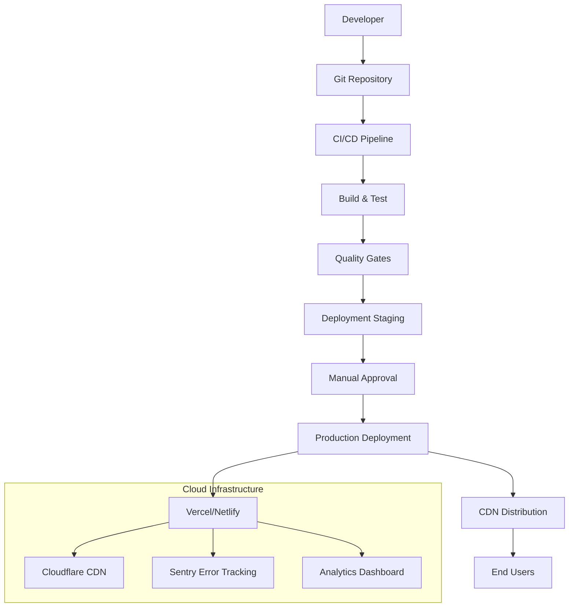

# Pomodorro Timer Deployment and CI/CD Pipeline

## 1. Deployment Strategy Overview

### 1.1 Deployment Architecture


### 1.2 Deployment Targets
- **Primary**: Vercel (automatic Git-based deployments)
- **Secondary**: Netlify (backup deployment)
- **Static Hosting**: Cloudflare Pages (edge deployment)
- **Backup**: GitHub Pages (manual fallback)

## 2. CI/CD Pipeline Configuration

### 2.1 GitHub Actions Workflow
```yaml
# .github/workflows/ci-cd.yml
name: CI/CD Pipeline

on:
  push:
    branches: [ main, develop ]
  pull_request:
    branches: [ main ]
  schedule:
    # Weekly security scans
    - cron: '0 0 * * 0'

jobs:
  # Job 1: Code Quality
  quality:
    name: Code Quality Checks
    runs-on: ubuntu-latest
    steps:
      - uses: actions/checkout@v3
      
      - name: Setup Node.js
        uses: actions/setup-node@v3
        with:
          node-version: '18.x'
          cache: 'npm'
      
      - name: Install dependencies
        run: npm ci
      
      - name: Lint check
        run: npm run lint
      
      - name: TypeScript compilation
        run: npm run type-check
      
      - name: Format check
        run: npm run format:check
      
      - name: Security audit
        run: npm audit --audit-level=high

  # Job 2: Testing
  test:
    name: Test Suite
    runs-on: ubuntu-latest
    needs: quality
    steps:
      - uses: actions/checkout@v3
      
      - name: Setup Node.js
        uses: actions/setup-node@v3
        with:
          node-version: '18.x'
          cache: 'npm'
      
      - name: Install dependencies
        run: npm ci
      
      - name: Run unit tests
        run: npm run test:unit
        env:
          CI: true
      
      - name: Run integration tests
        run: npm run test:integration
      
      - name: Run accessibility tests
        run: npm run test:a11y
      
      - name: Upload test coverage
        uses: codecov/codecov-action@v3
        with:
          file: ./coverage/lcov.info
          flags: unittests
      
      - name: Upload test results
        uses: actions/upload-artifact@v3
        with:
          name: test-results
          path: test-results/

  # Job 3: Build
  build:
    name: Build Application
    runs-on: ubuntu-latest
    needs: test
    steps:
      - uses: actions/checkout@v3
      
      - name: Setup Node.js
        uses: actions/setup-node@v3
        with:
          node-version: '18.x'
          cache: 'npm'
      
      - name: Install dependencies
        run: npm ci
      
      - name: Build production bundle
        run: npm run build
        env:
          NODE_ENV: production
          VITE_APP_VERSION: ${{ github.sha }}
      
      - name: Analyze bundle size
        run: npm run analyze
      
      - name: Upload build artifacts
        uses: actions/upload-artifact@v3
        with:
          name: production-build
          path: dist/
          retention-days: 7

  # Job 4: Performance Testing
  performance:
    name: Performance Testing
    runs-on: ubuntu-latest
    needs: build
    steps:
      - uses: actions/checkout@v3
      
      - name: Download build artifacts
        uses: actions/download-artifact@v3
        with:
          name: production-build
          path: dist
      
      - name: Serve build locally
        run: |
          npx serve dist -l 3000 &
          sleep 5
      
      - name: Run Lighthouse CI
        uses: treosh/lighthouse-ci-action@v9
        with:
          uploadArtifacts: true
          temporaryPublicStorage: true
          configPath: ./.lighthouserc.json

  # Job 5: Staging Deployment
  staging:
    name: Deploy to Staging
    runs-on: ubuntu-latest
    needs: performance
    environment:
      name: staging
      url: https://staging.pomodorro.app
    steps:
      - uses: actions/checkout@v3
      
      - name: Deploy to Vercel (Staging)
        uses: amondnet/vercel-action@v20
        with:
          vercel-token: ${{ secrets.VERCEL_TOKEN }}
          vercel-org-id: ${{ secrets.VERCEL_ORG_ID }}
          vercel-project-id: ${{ secrets.VERCEL_PROJECT_ID }}
          vercel-args: '--prod'
          working-directory: ./
          alias-domains: 'staging.pomodorro.app'

  # Job 6: E2E Testing (Staging)
  e2e:
    name: E2E Tests on Staging
    runs-on: ubuntu-latest
    needs: staging
    steps:
      - uses: actions/checkout@v3
      
      - name: Run Cypress E2E tests
        uses: cypress-io/github-action@v5
        with:
          browser: chrome
          headed: false
          record: true
          parallel: true
          group: 'Staging E2E'
          spec: cypress/e2e/**/*.spec.js
        env:
          CYPRESS_BASE_URL: https://staging.pomodorro.app
          CYPRESS_RECORD_KEY: ${{ secrets.CYPRESS_RECORD_KEY }}

  # Job 7: Production Deployment
  production:
    name: Deploy to Production
    runs-on: ubuntu-latest
    needs: e2e
    environment:
      name: production
      url: https://pomodorro.app
    if: github.ref == 'refs/heads/main'
    steps:
      - uses: actions/checkout@v3
      
      - name: Wait for manual approval
        uses: trstringer/manual-approval@v1
        with:
          secret: ${{ github.token }}
          approvers: ${{ secrets.PRODUCTION_APPROVERS }}
          minimum-approvals: 1
          issue-title: 'Production Deployment Approval'
          issue-body: 'Please approve deployment of commit ${{ github.sha }} to production.'
      
      - name: Deploy to Vercel (Production)
        uses: amondnet/vercel-action@v20
        with:
          vercel-token: ${{ secrets.VERCEL_TOKEN }}
          vercel-org-id: ${{ secrets.VERCEL_ORG_ID }}
          vercel-project-id: ${{ secrets.VERCEL_PROJECT_ID }}
          vercel-args: '--prod --confirm'
          working-directory: ./
          alias-domains: 'pomodorro.app'
      
      - name: Invalidate CDN cache
        run: |
          curl -X POST "https://api.cloudflare.com/client/v4/zones/${{ secrets.CLOUDFLARE_ZONE_ID }}/purge_cache" \
            -H "Authorization: Bearer ${{ secrets.CLOUDFLARE_API_TOKEN }}" \
            -H "Content-Type: application/json" \
            --data '{"purge_everything":true}'
      
      - name: Create GitHub release
        uses: softprops/action-gh-release@v1
        with:
          tag_name: v${{ github.run_number }}
          name: Release v${{ github.run_number }}
          body: |
            Production deployment for commit ${{ github.sha }}
            
            **Changes:**
            ${{ github.event.head_commit.message }}
            
            **Build Number:** ${{ github.run_number }}
          draft: false
          prerelease: false

  # Job 8: Post-deployment verification
  verification:
    name: Post-deployment Verification
    runs-on: ubuntu-latest
    needs: production
    steps:
      - name: Health check
        run: |
          curl -f https://pomodorro.app/health || exit 1
      
      - name: Smoke tests
        run: |
          curl -f https://pomodorro.app || exit 1
          curl -f https://pomodorro.app/manifest.json || exit 1
          curl -f https://pomodorro.app/service-worker.js || exit 1
      
      - name: Performance check
        run: |
          curl -s "https://www.googleapis.com/pagespeedonline/v5/runPagespeed?url=https://pomodorro.app&strategy=mobile" | jq '.lighthouseResult.categories.performance.score'
```

### 2.2 Quality Gates
```yaml
# Quality thresholds
QUALITY_GATES:
  test_coverage:
    unit: 80%
    integration: 70%
    total: 75%
  
  performance:
    lighthouse_score: 90
    first_contentful_paint: 1.8s
    largest_contentful_paint: 2.5s
    cumulative_layout_shift: 0.1
    first_input_delay: 100ms
  
  bundle_size:
    max_total: 500KB
    max_initial: 250KB
    max_chunk: 100KB
  
  security:
    vulnerabilities: 0 critical, 0 high
    dependency_audit: pass
    snyk_scan: pass
```

## 3. Deployment Environments

### 3.1 Environment Configuration
```typescript
// Environment configuration
const ENVIRONMENTS = {
  development: {
    name: 'Development',
    api: 'http://localhost:3000',
    analytics: false,
    debug: true,
    features: {
      experimental: true,
      devTools: true
    }
  },
  
  staging: {
    name: 'Staging',
    api: 'https://staging-api.pomodorro.app',
    analytics: true,
    debug: true,
    features: {
      experimental: true,
      devTools: false
    }
  },
  
  production: {
    name: 'Production',
    api: 'https://api.pomodorro.app',
    analytics: true,
    debug: false,
    features: {
      experimental: false,
      devTools: false
    }
  }
};

// Build-time environment variables
interface BuildEnv {
  VITE_APP_ENV: 'development' | 'staging' | 'production';
  VITE_APP_VERSION: string;
  VITE_API_BASE_URL: string;
  VITE_SENTRY_DSN: string;
  VITE_ANALYTICS_ID: string;
}
```

### 3.2 Environment-Specific Builds
```javascript
// vite.config.js
import { defineConfig, loadEnv } from 'vite';
import react from '@vitejs/plugin-react';

export default defineConfig(({ mode }) => {
  const env = loadEnv(mode, process.cwd(), '');
  
  return {
    plugins: [react()],
    define: {
      __APP_ENV__: JSON.stringify(env.VITE_APP_ENV),
      __APP_VERSION__: JSON.stringify(env.VITE_APP_VERSION),
    },
    build: {
      sourcemap: env.VITE_APP_ENV !== 'production',
      minify: 'terser',
      terserOptions: {
        compress: {
          drop_console: env.VITE_APP_ENV === 'production',
          drop_debugger: env.VITE_APP_ENV === 'production',
        },
      },
      rollupOptions: {
        output: {
          manualChunks: {
            vendor: ['react', 'react-dom', 'react-router-dom'],
            utils: ['date-fns', 'uuid', 'localforage'],
          },
        },
      },
    },
  };
});
```

## 4. Hosting Configuration

### 4.1 Vercel Configuration
```json
// vercel.json
{
  "buildCommand": "npm run build",
  "outputDirectory": "dist",
  "devCommand": "npm run dev",
  "installCommand": "npm ci",
  "framework": "vite",
  "regions": ["fra1"],
  "env": {
    "VITE_APP_ENV": "production"
  },
  "headers": [
    {
      "source": "/(.*)",
      "headers": [
        {
          "key": "X-Content-Type-Options",
          "value": "nosniff"
        },
        {
          "key": "X-Frame-Options",
          "value": "DENY"
        },
        {
          "key": "X-XSS-Protection",
          "value": "1; mode=block"
        },
        {
          "key": "Referrer-Policy",
          "value": "strict-origin-when-cross-origin"
        },
        {
          "key": "Permissions-Policy",
          "value": "camera=(), microphone=(), geolocation=()"
        }
      ]
    },
    {
      "source": "/service-worker.js",
      "headers": [
        {
          "key": "Cache-Control",
          "value": "no-cache, no-store, must-revalidate"
        },
        {
          "key": "Content-Type",
          "value": "application/javascript; charset=utf-8"
        }
      ]
    }
  ],
  "rewrites": [
    {
      "source": "/(.*)",
      "destination": "/index.html"
    }
  ]
}
```

### 4.2 Cloudflare Configuration
```toml
# wrangler.toml
name = "pomodorro-timer"
type = "webpack"
account_id = "your-account-id"
workers_dev = false

[env.production]
zone_id = "your-zone-id"
routes = [
  "pomodorro.app/*",
  "www.pomodorro.app/*"
]

[site]
bucket = "./dist"
entry-point = "workers-site"

[[build]]
command = "npm run build"

[[build.upload]]
format = "service-worker"
```

### 4.3 Netlify Configuration
```toml
# netlify.toml
[build]
  command = "npm run build"
  publish = "dist"

[build.environment]
  NODE_VERSION = "18"
  NPM_VERSION = "9"

[context.production.environment]
  VITE_APP_ENV = "production"

[context.deploy-preview.environment]
  VITE_APP_ENV = "staging"

[context.branch-deploy.environment]
  VITE_APP_ENV = "development"

[[redirects]]
  from = "/*"
  to = "/index.html"
  status = 200

[[headers]]
  for = "/*"
  [headers.values]
    X-Frame-Options = "DENY"
    X-Content-Type-Options = "nosniff"
    X-XSS-Protection = "1; mode=block"
    Referrer-Policy = "strict-origin-when-cross-origin"

[[headers]]
  for = "/service-worker.js"
  [headers.values]
    Cache-Control = "no-cache, no-store, must-revalidate"
```

## 5. Monitoring and Observability

### 5.1 Application Monitoring
```typescript
// Monitoring setup
import * as Sentry from '@sentry/react';
import { BrowserTracing } from '@sentry/tracing';

const initMonitoring = () => {
  if (import.meta.env.VITE_APP_ENV === 'production') {
    Sentry.init({
      dsn: import.meta.env.VITE_SENTRY_DSN,
      integrations: [new BrowserTracing()],
      tracesSampleRate: 0.1,
      environment: import.meta.env.VITE_APP_ENV,
      release: import.meta.env.VITE_APP_VERSION,
      
      beforeSend(event) {
        // Filter out sensitive data
        if (event.request) {
          delete event.request.cookies;
          delete event.request.headers['Cookie'];
        }
        return event;
      }
    });
  }
};

// Performance monitoring
const reportWebVitals = (metric: any) => {
  if (import.meta.env.VITE_APP_ENV === 'production') {
    // Send to analytics
    const body = JSON.stringify(metric);
    navigator.sendBeacon('/api/web-vitals', body);
    
    // Log to console in development
    if (import.meta.env.DEV) {
      console.log(metric);
    }
  }
};
```

### 5.2 Error Tracking
```typescript
// Error boundary with monitoring
class ErrorBoundary extends React.Component {
  componentDidCatch(error: Error, errorInfo: React.ErrorInfo) {
    if (import.meta.env.VITE_APP_ENV === 'production') {
      Sentry.withScope((scope) => {
        scope.setExtras(errorInfo);
        Sentry.captureException(error);
      });
    }
    
    // Log to console
    console.error('ErrorBoundary caught an error:', error, errorInfo);
    
    // Report to analytics
    this.reportError(error);
  }
  
  private reportError(error: Error) {
    const errorData = {
      name: error.name,
      message: error.message,
      stack: error.stack,
      timestamp: new Date().toISOString(),
      url: window.location.href,
      userAgent: navigator.userAgent,
    };
    
    // Send to error tracking endpoint
    fetch('/api/errors', {
      method: 'POST',
      headers: { 'Content-Type': 'application/json' },
      body: JSON.stringify(errorData),
    }).catch(() => {
      // Silently fail if error reporting fails
    });
  }
}
```

### 5.3 Performance Monitoring
```typescript
// Performance metrics collection
class PerformanceMonitor {
  private metrics: PerformanceMetric[] = [];
  private reportInterval = 60000; // 1 minute
  
  startMonitoring() {
    // Monitor Core Web Vitals
    this.monitorCLS();
    this.monitorLCP();
    this.monitorFID();
    
    // Monitor custom metrics
    this.monitorTimerPerformance();
    this.monitorStoragePerformance();
    
    // Periodic reporting
    setInterval(() => this.reportMetrics(), this.reportInterval);
  }
  
  private monitorTimerPerformance() {
    const originalSetInterval = window.setInterval;
    const originalSetTimeout = window.setTimeout;
    
    // Monitor timer accuracy
    window.setInterval = (handler, timeout, ...args) => {
      const start = performance.now();
      const id = originalSetInterval(() => {
        const end = performance.now();
        const drift = end - start - timeout;
        
        if (Math.abs(drift) > 10) {
          this.recordMetric('timer_drift', {
            drift,
            timeout,
            timestamp: Date.now(),
          });
        }
        
        handler();
      }, timeout, ...args);
      
      return id;
    };
  }
  
  private reportMetrics() {
    if (this.metrics.length === 0) return;
    
    const report = {
      metrics: this.metrics,
      timestamp: new Date().toISOString(),
      sessionId: this.getSessionId(),
    };
    
    // Send to analytics
    fetch('/api/performance', {
      method: 'POST',
      headers: { 'Content-Type': 'application/json' },
      body: JSON.stringify(report),
    }).then(() => {
      this.metrics = [];
    }).catch(() => {
      // Queue for retry
      this.queueForRetry(report);
    });
  }
}
```

## 6. Security Configuration

### 6.1 Content Security Policy
```html
<!-- CSP meta tag (fallback) -->
<meta http-equiv="Content-Security-Policy" content="
  default-src 'self';
  script-src 'self' 'unsafe-inline' 'unsafe-eval' https://cdn.sentry.io;
  style-src 'self' 'unsafe-inline' https://fonts.googleapis.com;
  font-src 'self' https://fonts.gstatic.com;
  img-src 'self' data: https:;
  connect-src 'self' https://api.pomodorro.app https://sentry.io;
  frame-ancestors 'none';
  base-uri 'self';
  form-action 'self';
">
```

### 6.2 Security Headers
```nginx
# Nginx configuration for security headers
add_header X-Frame-Options "DENY" always;
add_header X-Content-Type-Options "nosniff" always;
add_header X-XSS-Protection "1; mode=block" always;
add_header Referrer-Policy "strict-origin-when-cross-origin" always;
add_header Content-Security-Policy "default-src 'self'; script-src 'self' 'unsafe-inline'; style-src 'self' 'unsafe-inline'; img-src 'self' data: https:; font-src 'self' https://fonts.gstatic.com; connect-src 'self' https://api.pomodorro.app;" always;
add_header Permissions-Policy "camera=(), microphone=(), geolocation=()" always;
add_header Strict-Transport-Security "max-age=31536000; includeSubDomains" always;
```

### 6.3 Dependency Security
```json
// package.json security scripts
{
  "scripts": {
    "security:audit": "npm audit --audit-level=high",
    "security:scan": "npx snyk test",
    "security:update": "npm audit fix",
    "security:check": "npm run security:audit && npm run security:scan",
    "security:ci": "npm audit --audit-level=high --json > audit.json"
  }
}
```

## 7. Rollback and Disaster Recovery

### 7.1 Rollback Procedures
```yaml
# Rollback automation
rollback_procedures:
  automated:
    trigger: "error_rate > 5% for 5 minutes"
    actions:
      - "pause_deployments"
      - "revert_to_previous_version"
      - "notify_team"
      - "investigate_root_cause"
  
  manual:
    steps:
      - "Identify problematic version"
      - "Check Vercel deployment history"
      - "Revert to previous deployment"
      - "Verify rollback success"
      - "Update incident documentation"
  
  emergency:
    steps:
      - "Deploy static maintenance page"
      - "Disable user sessions"
      - "Preserve user data"
      - "Communicate with users"
```

### 7.2 Backup Deployment
```bash
#!/bin/bash
# emergency-deploy.sh
set -e

echo "Starting emergency deployment..."

# Build locally
npm ci
npm run build

# Deploy to backup location (GitHub Pages)
cd dist
git init
git add -A
git commit -m "Emergency deployment $(date)"
git branch -M main
git remote add origin https://github.com/username/pomodorro-backup.git
git push -f origin main

echo "Emergency deployment complete"
echo "Backup URL: https://username.github.io/pomodorro-backup/"
```

## 8. Continuous Improvement

### 8.1 Performance Budgets
```json
// .performance-budget.json
{
  "budgets": [
    {
      "resourceType": "document",
      "budget": 50
    },
    {
      "resourceType": "script",
      "budget": 250
    },
    {
      "resourceType": "stylesheet",
      "budget": 50
    },
    {
      "resourceType": "image",
      "budget": 150
    },
    {
      "resourceType": "font",
      "budget": 100
    },
    {
      "resourceType": "media",
      "budget": 0
    },
    {
      "resourceType": "other",
      "budget": 50
    },
    {
      "resourceType": "total",
      "budget": 500
    }
  ]
}
```

### 8.2 Deployment Metrics
```typescript
// Deployment metrics tracking
interface DeploymentMetrics {
  deployment_id: string;
  timestamp: string;
  duration: number; // seconds
  success: boolean;
  build_size: number; // bytes
  performance_score: number;
  test_coverage: number;
  error_rate: number; // post-deployment
  rollback_required: boolean;
  user_impact: 'none' | 'low' | 'medium' | 'high';
}

// Track deployment success rate
class DeploymentTracker {
  private deployments: DeploymentMetrics[] = [];
  
  trackDeployment(metrics: DeploymentMetrics) {
    this.deployments.push(metrics);
    this.analyzeTrends();
    this.alertOnAnomalies(metrics);
  }
  
  calculateSuccessRate(): number {
    const successful = this.deployments.filter(d => d.success);
    return (successful.length / this.deployments.length) * 100;
  }
  
  analyzeTrends() {
    // Analyze deployment performance over time
    const recent = this.deployments.slice(-10);
    const avgDuration = recent.reduce((sum, d) => sum + d.duration, 0) / recent.length;
    const avgScore = recent.reduce((sum, d) => sum + d.performance_score, 0) / recent.length;
    
    console.log(`Average deployment duration: ${avgDuration.toFixed(2)}s`);
    console.log(`Average performance score: ${avgScore.toFixed(1)}`);
  }
}
```

## 9. Implementation Checklist

### 9.1 Phase 1: Basic CI/CD
- [ ] Set up GitHub Actions workflow
- [ ] Configure linting and type checking
- [ ] Implement unit test automation
- [ ] Set up build automation
- [ ] Configure Vercel for staging deployments

### 9.2 Phase 2: Advanced CI/CD
- [ ] Add integration and E2E tests
- [ ] Implement performance testing
- [ ] Set up quality gates
- [ ] Configure production deployment with approval
- [ ] Implement rollback procedures

### 9.3 Phase 3: Monitoring & Observability
- [ ] Configure error tracking (Sentry)
- [ ] Implement performance monitoring
- [ ] Set up analytics
- [ ] Configure security scanning
- [ ] Implement health checks

### 9.4 Phase 4: Optimization
- [ ] Implement CDN caching
- [ ] Configure service worker for offline
- [ ] Set up A/B testing framework
- [ ] Implement canary deployments
- [ ] Configure feature flags

## 10. Cost Optimization

### 10.1 Hosting Costs
```yaml
estimated_monthly_costs:
  vercel:
    hobby_plan: $0
    pro_plan: $20
    enterprise: $custom
  
  cloudflare:
    free_tier: $0
    pro_tier: $20
  
  monitoring:
    sentry_free: $0
    sentry_team: $26
    google_analytics: $0
  
  total_estimated:
    minimum: $0
    recommended: $46
    enterprise: $200+
```

### 10.2 Optimization Strategies
- Use Vercel's free tier for staging
- Implement aggressive caching to reduce bandwidth
- Use Cloudflare's free CDN
- Monitor and clean up old deployments
- Use tree shaking and code splitting to reduce bundle size
- Implement lazy loading for non-critical resources

## 11. Compliance and Documentation

### 11.1 Deployment Documentation
- **Runbook**: Step-by-step deployment instructions
- **Rollback Procedures**: Detailed rollback steps
- **Incident Response**: Handling deployment failures
- **Communication Plan**: Notifying stakeholders
- **Post-mortem Template**: Analyzing deployment issues

### 11.2 Compliance Requirements
- **GDPR**: Data privacy and user consent
- **Accessibility**: WCAG 2.1 AA compliance
- **Performance**: Core Web Vitals thresholds
- **Security**: OWASP Top 10 compliance
- **Reliability**: 99.9% uptime target

## 12. Future Enhancements

### 12.1 Planned Improvements
1. **Canary Deployments**: Gradual rollout to percentage of users
2. **A/B Testing Framework**: Feature flag management
3. **Blue-Green Deployments**: Zero-downtime deployments
4. **Automated Performance Regression Detection**
5. **Self-healing Deployments**: Automatic rollback on failure
6. **Multi-region Deployment**: Global CDN optimization
7. **Real-time Deployment Dashboard**: Live monitoring of deployments

### 12.2 Scalability Considerations
- **Traffic Spikes**: Handling sudden increases in users
- **Global Distribution**: CDN optimization for international users
- **Database Scaling**: IndexedDB performance with large datasets
- **Monitoring Scalability**: Handling increased monitoring data
- **Cost Management**: Scaling costs with user growth